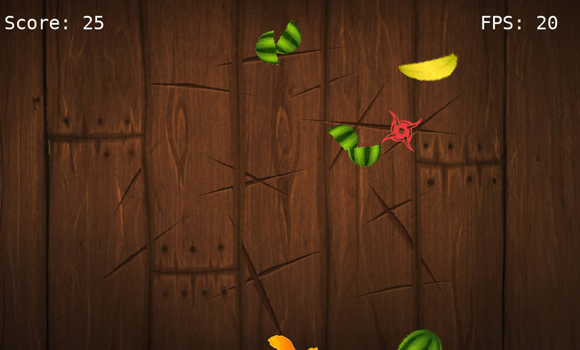
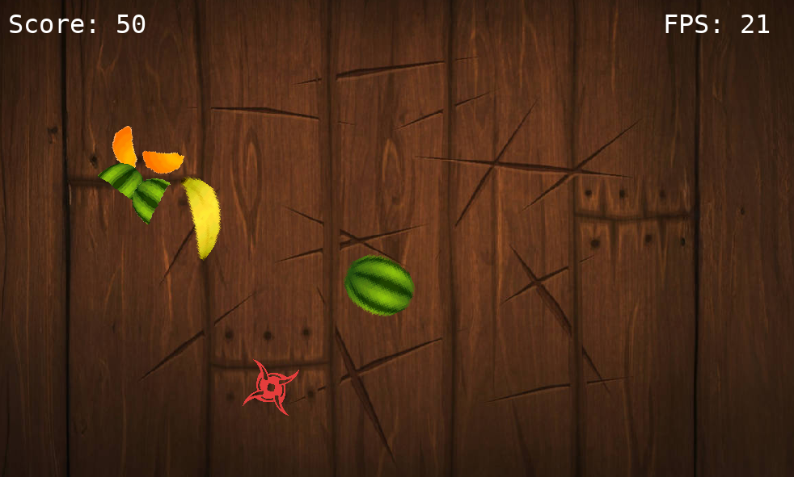
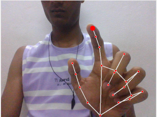

# Finger Slasher

**Finger Slasher** is a Python-based Fruit Ninja style game that uses **real-time finger tracking via webcam** to control an on-screen blade and slice flying fruits. No mouse or keyboard — just your finger!

***

## Screenshots:

<table>
  <tr>
    <td align="center">
      
    </td>
    <td align="center">
      
    </td>
  </tr>
</table>

## Finger Tracking

The game captures your index fingertip coordinates from the webcam and maps them to the game screen in real time.

<p align="center">
  
</p>

***

## Controls:

- Simply wave your **index finger** in front of the webcam to slash fruits.
- A star-shaped blade follows your fingertip.
- Slicing a fruit increases your score.
- Press `Q` or click the window close button to **exit** the game.

***

## How to run the game:
1. **Clone the repository**:
   ```bash
   git clone https://github.com/apexyash27/Finger-Slasher
   cd Finger-Slasher
   ```

2. Make sure Python 3.8.8 or higher is installed.

3. Install the packages in <b>requirements.txt</b>, using the following command in the terminal in the game folder:
   ```bash
   pip install -r requirements.txt
   ```

4. Run the game:
   ```bash
   python3 main.py
   ```

***

## Notes:
1. Make sure your webcam is functioning.

2. Use a well-lit environment for best tracking performance.

***

### Enjoy slicing fruits with your fingers! 🍉🍌🍊

